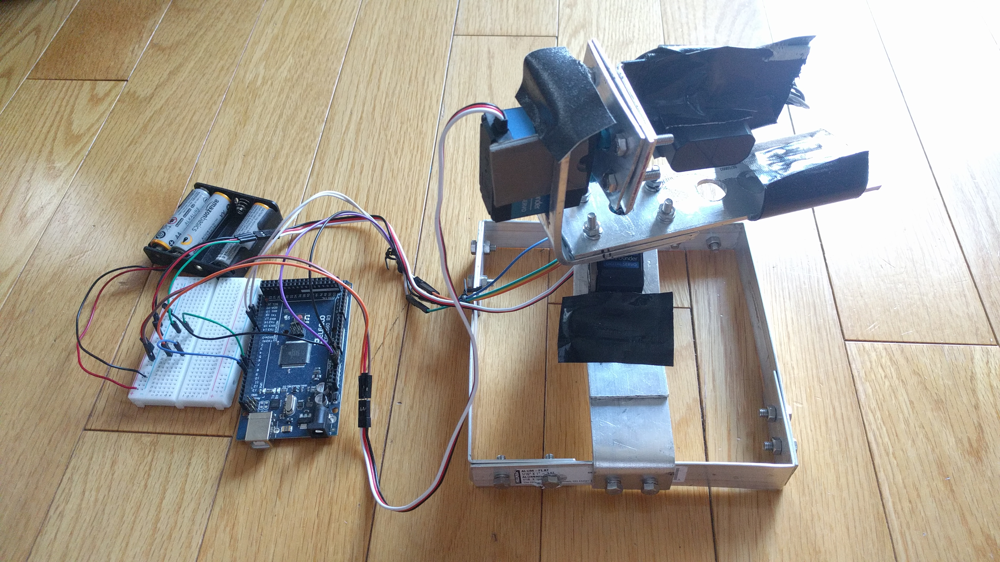
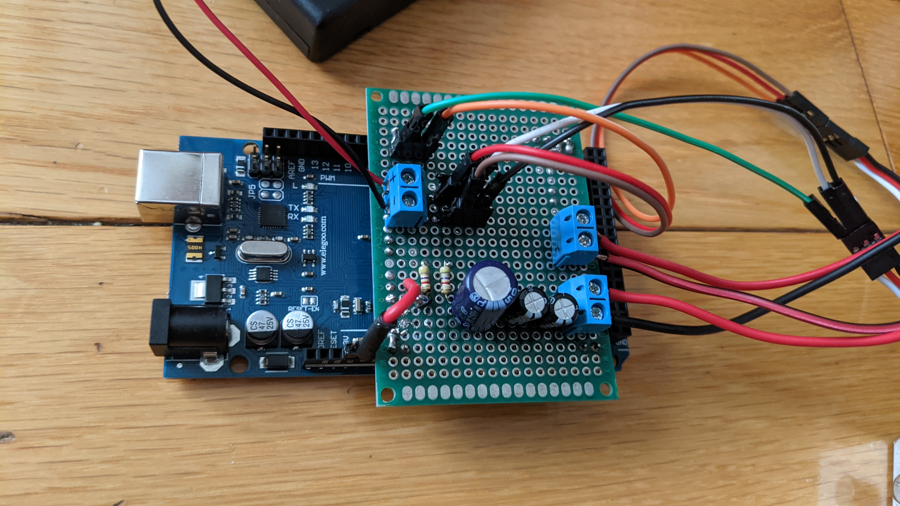
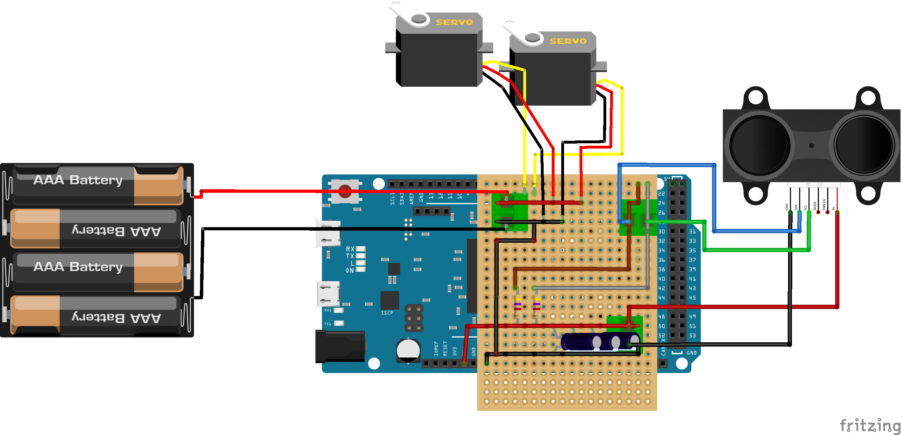
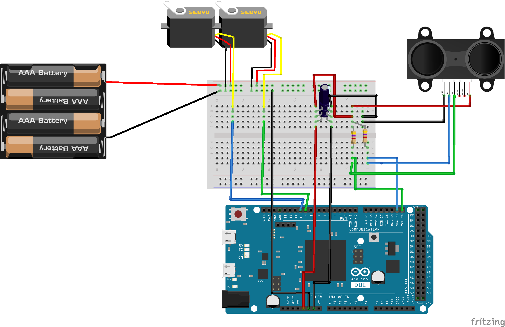
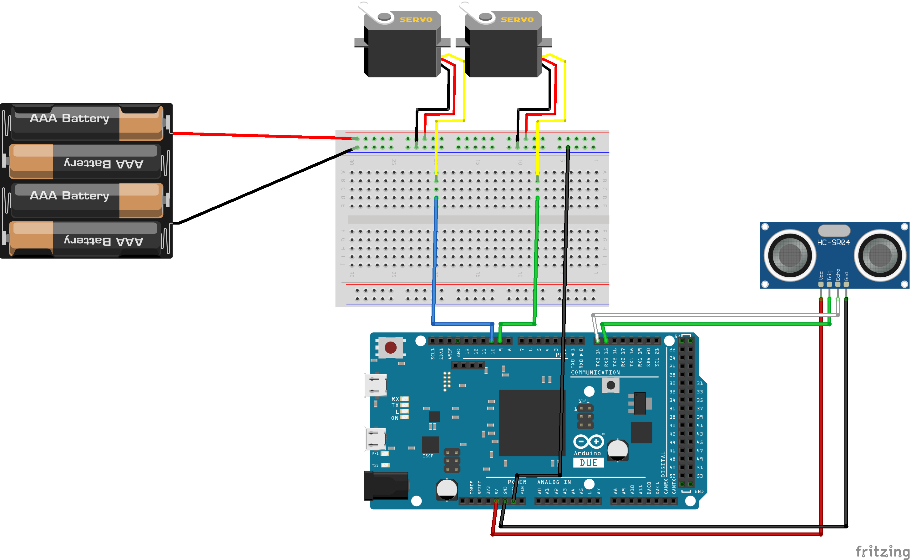
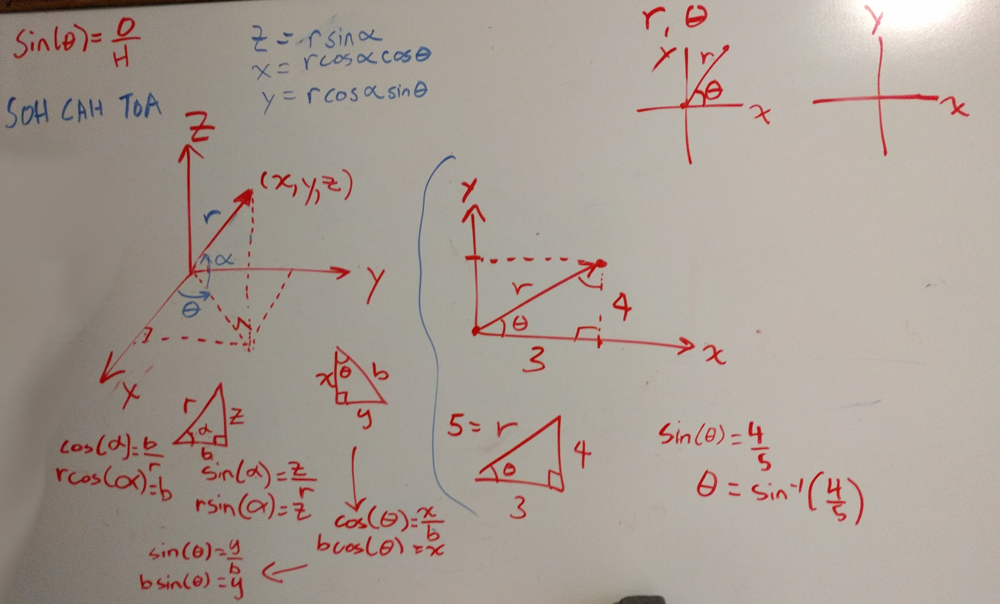

# LidarScanner3D

I designed and implemented a system from scratch which allows you to map a point cloud of your environment and nearby objects using LIDAR, Arduino, and Unreal Engine 4. 

I made the real time visualization tool using Unreal Engine and interfaced the LIDAR with an Arduino Mega using UART and I2C communication protocols.

In order for the Arduino to communicate with Unreal Engine 4, I used the "UE4Duino" plugin created by [RVillani](https://github.com/RVillani/UE4Duino).

Example scan of a sofa using a Lidar Lite-V3 (the white color in the middle is the location this scanning system):

Demonstration of the Lidar rotation with real-time mapping display:

## Instructions to Run
- Hook everything up to the Arduino according to the [circuit  diagrams below](#circuit-diagrams)
- Upload the appropriate Arduino code, depending on which LIDAR you are using
- Run the `LidarScanner.exe` application, specify `Com Port`, `baud rate`, `scan type` and go from there

*Note: The `exe` is available in the releases of this repository.*

## Help/Tips
When trying to load a previously saved scan into Unreal Engine 4 project:
- Remember to rename the `.sav` file to `ScanDataSave.sav`
- The file goes in `.\LidarScanner3D\LidarScannerUE4\Saved\SaveGames`

When trying to load a previously saved scan into the comipled `LidarScanner.exe`:
- Go to `.\LidarScannerUE4Compiled\LidarScanner\Saved\SaveGames` and find `ScanDataSave.sav`
    - Note: This file has the point cloud data
- If wanted, copy or move it out into a different folder to keep for later and can rename it to something like `room.sav`
- To load back in, name the file as `ScanDataSave.sav` and move it to the `SaveGames` folder

## Mechanical Design 
Although I made the [first prototype out of wood](./Pics/LidarScannerPic5.jpg), the final design for the Lidar pan-and-tilt was hand built from Aluminum plates. It allows for easy portability, rotation, and great stability.

There are 2 servos needed in order to achieve the scan. Servo 1 is placed right side up allowing the Lidar to rotate horizontally from side to side, and Servo 2 is placed sideways on Servo 1 allowing the Lidar to tilt vertically. To achieve a scan that fixes the tilt in the placement data, calculations have been done as shown [below](#point-calculations).

## Circuit Diagrams

I have interfaced the Lidar Lite V3 and TFMini Plus Lidar range finders with an Arduino Mega. I chose to do this using a perfboard for easy development and modularity. Some circuit schematics I made in Fritzing are shown below:

For Lidar Lite V3 using perfboard:

For Lidar Lite V3 using breadboard:

For TFMini Plus:

 (Note: Replace the Sonar in the diagram with a TFMini Plus. The wiring from the TFMini Plus is based on the colors in the diagram).

For more pictures and diagrams, see the [Pics folder](https://github.com/AshishA26/LidarScanner3D/tree/main/Pics) of this repo.

## Point calculations
The LIDAR sensor measures a distance to the object, and the current orientation of this sensor is given by the servo positions. The angle calculations I did for finding the exact location of the point relative to the LIDAR in 3D Space using vector geometry are shown below:

